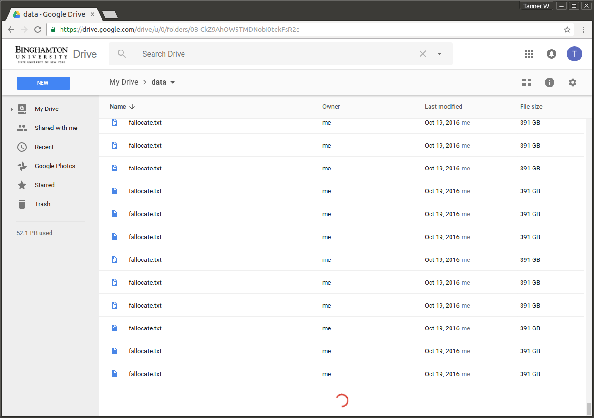

# Is Google Drive Storage Really "Unlimited?"

Binghamton University claims that the Google Drive storage on my school sponsored account is "unlimited." We'll see.

## Current Strategy

## Updates

At first, I tried uploading huge files to Google Drive using [gdrive](https://github.com/prasmussen/gdrive). The average upload speed from my desktop is about 3.0 MB per second; it would take over 3 days to upload a single TB. I began looking for another solution.

Next, I noticed that copying files that are already in Google Drive is much faster (and isn't limited by internet speed). I decided to write a script to automate file copy in Google Drive.

I used the Google Drive API with Python to find and copy a file. Once copying worked, I set up a simple for loop and tested with a 132 GB text file; the script increased drive size by about 150 GB per second. Next I ran 5 instances of the script at 65,000 copy iterations; the program ran for about 24 hours, leaving the total Google Drive size at 35 PB. It's worth noting that 2 of the 5 instances crashed because they exceeded the alloted number of service requests.

To increase the expansion rate further, I will optimize the script and use it with even larger files; I am currently uploading a 420 GB text file (which will triple the current expansion rate). If I copy a 10 TB file (the maximum size allowed on my university account), it would increase expansion rate by a factor of 65. Ideally I will find a way to merge the contents of two files in Google Drive so that I can generate a 10 TB file without having to upload it.

According to a [What if? question](https://what-if.xkcd.com/63/) posed a few years ago, Google has a storage capacity of approximately 15 exabytes. Based on this estimate, the 35 PB I generated today (October 17) account for 0.2% of Google's total storage space.

Currently, I am supposedly using 52.1 petabytes (52,100 terabytes) of storage space and I still haven't heard from Google.

October 22: Something isn't adding up. Each copy of a file takes less than a second to process, so it's likely that each is a shallow copy. I will have to adjust my scheme. First I will have to develop a way to generate files that are very difficult to compress, and then I will have to find a fast way to generate modified copies in Google Drive so that they remain difficult to compress and are not redundant with the originals.

October 28: According to Gmail, I am using 54,646,653.06 GB. According to the Drive app for iOS, my drive has a capacity of 54,656,892 GB storage space. It seems that "storage capacity" is updated based on current usage; I will check with friends to see what their capacity is.
## Resources

- [Quickly create a large file on a Linux system?](http://stackoverflow.com/questions/257844/quickly-create-a-large-file-on-a-linux-system)
- [How to upload a file to Google Drive from the command line](http://olivermarshall.net/how-to-upload-a-file-to-google-drive-from-the-command-line/)
- [How can I make a copy of a file in Google Drive via Python?](http://stackoverflow.com/questions/30716568/how-can-i-make-a-copy-of-a-file-in-google-drive-via-python)
- [Google Drive APIs: Python Quickstart](https://developers.google.com/drive/v3/web/quickstart/python)
- [Google Drive APIs: File Copy](https://developers.google.com/drive/v2/reference/files/copy#auth)
- [How can you merge two Google Documents?](http://webapps.stackexchange.com/questions/9641/how-can-you-merge-two-google-documents)
- [Compression of random data is impossible?](http://cs.stackexchange.com/questions/40239/compression-of-random-data-is-impossible)
